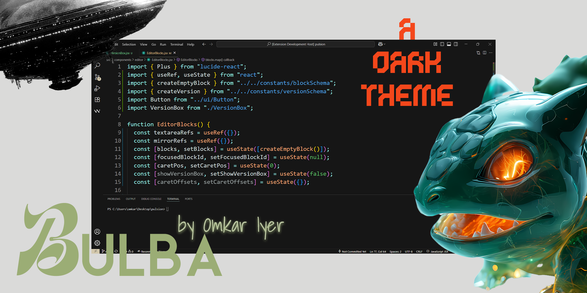

# •( ˃ᴗ˂ )• **BULBA – VS Code Theme** 〢「 welcome 〢

## Foreword

**Bulba** is a forestwood-style and bulbasaur-pokemon inspired dark theme for VS-Code. It's carefully designed keeping visual hierarchy in mind with custom color palette to tune your attention towards the syntax which you'd pay most attention to progressively muting the rest which requires less attention.

## ─𒌋𒀖 Installation Guide :

1. Extensions → Search for 'Bulba' → Install

2. Apply Theme

- > Command Palette (Ctrl + Shift + P) → Bulba: select theme

- **OR**

- > File → Preferences → Theme → Color Theme

 

## ─𒌋𒀖 Discord Server

You can also join our Discord Server : here - [CLick me to JOIN Discord Server](https://discord.gg/NE5THYBfjn)

 

Made with 💖 by [Omkar](https://github.com/omkar-4)

